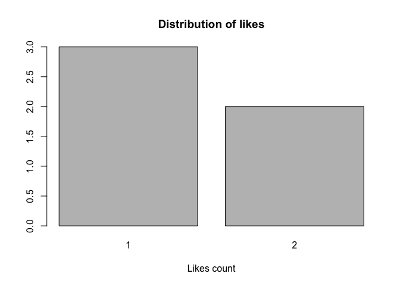

Rvk: R Interface to VK (VKontakte) API
--------------------------------------

Hi! Welcome to **Rvk**, an R package to access VK data!

VK is a highly popular social network in Russia and some other countries
that has an open API allowing to access and analyze large amounts of
data. This package provides a set of functions to extract publicly
available data from VK.

### Installation

You can easily install the package from GitHub:

    install.packages('devtools')
    devtools::install_github('denisStukal/Rvk')

### Authorization

Most functions require that you pass your **access token** as a function
argument. An **access token** is a unique set of symbols that works as
your password to API calls. If you have already used VK API and have a
token, you can skip this section and jump immediately to the next
section to start working with VK data. Otherwise, read documentation for
the makeAccessToken() function that will take you through the process:

    ?Rvk::makeAccessToken

### Example: Personal VK page

I'm going to scrape the VK page for Rvk Demo, an account created for
this R package, as an example of how to use the pakcage to access and
process VK data.

    # Set the user ID (available from the user page) and the access token
    userid = 442316971 
    mytoken = readLines(con = '~/Downloads/mytoken_trial')

    # Get basic information about the group
    user_info <- Rvk::getUserInfo(user_id = userid, access_token = mytoken)
    str(user_info)

    ## 'data.frame':    1 obs. of  22 variables:
    ##  $ id                 : int 442316971
    ##  $ first_name         : chr "Rvk"
    ##  $ last_name          : chr "Demo"
    ##  $ sex                : chr "male"
    ##  $ screen_name        : chr "id442316971"
    ##  $ bdate              : chr "14.8.2000"
    ##  $ city               : chr "New York City"
    ##  $ country            : chr "США"
    ##  $ relation           : int 0
    ##  $ has_photo          : int 1
    ##  $ num_wall_comments  : int 1
    ##  $ photo_url          : chr "https://pp.userapi.com/c837532/v837532153/58c54/Pbb6JXejpJc.jpg"
    ##  $ has_mobile         : int 1
    ##  $ status             : chr ""
    ##  $ last_seen          : int 1503577155
    ##  $ last_seen_date     : Date, format: "2017-08-24"
    ##  $ universities_number:List of 1
    ##   ..$ : logi 
    ##  $ universities       :List of 1
    ##   ..$ : logi 
    ##  $ schools_number     :List of 1
    ##   ..$ : logi 
    ##  $ schools            :List of 1
    ##   ..$ : logi 
    ##  $ jobs_number        :List of 1
    ##   ..$ : logi 
    ##  $ career             :List of 1
    ##   ..$ : logi

Now, we want to scrape the user's wall and get some publicly available
posts. While executing this command, we need to specify the number of
posts we want to retrieve. We could potentially consider all of them,
but I will take only the last 5.

    user_wall <- Rvk::getUserWall(user_id = userid, access_token = mytoken, n = 5)

    ## Total time: 0.03 minutes

    str(subset(user_wall, select = c(id, date, text, comments_count, likes_count, reposts_count, reposted, reposted_from_id, reposted_original_date)))

    ## 'data.frame':    5 obs. of  9 variables:
    ##  $ id                    : int  2 6 5 4 3
    ##  $ date                  : Date, format: "2017-08-14" "2017-08-15" ...
    ##  $ text                  : chr  "Hi! My name is Denis Stukal, and I am glad to finally preset the first R package that provides a set of functio"| __truncated__ "\"Now is better than ever before to start studying machine learning and artificial intelligence. The field has "| __truncated__ "Having a vacation in academia be like...\nAccessed from: http://phdcomics.com/comics/archive/phd080117s.gif" "" ...
    ##  $ comments_count        : int  0 1 2 0 0
    ##  $ likes_count           : int  1 2 2 1 1
    ##  $ reposts_count         : int  1 1 0 0 0
    ##  $ reposted              : num  0 0 0 1 0
    ##  $ reposted_from_id      : int  NA NA NA -138477641 NA
    ##  $ reposted_original_date: num  NA NA NA 17392 NA

One can get most important posts by extracting those that were liked,
reposted, or commented the most. First, let's look at the distribution
of the number of likes for the extracted 5 posts.

    barplot(table(user_wall$likes_count), main = 'Distribution of likes', xlab = 'Likes count')

Most posts are liked just once, but there is one post that got 2 likes.
Let's extract it as well as most commented and reposted posts.

    # Posts: most liked
    most_liked <- user_wall$id[order(user_wall$likes_count, decreasing = T)][1]
    range(user_wall$likes_count[user_wall$id %in% most_liked])

    ## [1] 2 2

    # Posts: most commented
    most_commented <- user_wall$id[order(user_wall$comments_count, decreasing = T)][1]
    range(user_wall$comments_count[user_wall$id %in% most_commented])

    ## [1] 2 2

    # Posts: most reposted
    most_reposted <- user_wall$id[order(user_wall$reposts_count, decreasing = T)][1]
    range(user_wall$reposts_count[user_wall$id %in% most_reposted])

    ## [1] 1 1

One can also identify the most active users by activity type (liking,
reposting, commenting).

    users_like <- Rvk::getUserMostLikingUsers(user_id = userid, num_posts = 5, num_users = 2, access_token = mytoken)

    ## Total time: 0.1737833 minutes

    users_repost <- Rvk::getUserMostRepostingUsers(user_id = userid, num_posts = 5, num_users = 2, access_token = mytoken)

    ## Total time: 0.1717333 minutes

    users_comment <- Rvk::getUserMostCommentingUsers(user_id = userid, num_posts = 5, num_users = 2, access_token = mytoken)

    ## Total time: 0.1663333 minutes

These three variables store data.frames with user IDs and numbers of
likes/reposts/comments for those users who left most of those on the
wall. Had there been no likes/reposts/comments, the corresponding
variable would have been NULL.

Finally, you might be interested in the number of and information about
all friends the user has. You can get those as easily as this:

    friends_num <- Rvk::getUserFriendsNum(user_id = userid, access_token = mytoken)
    friends_data <- Rvk::getUserFriendsInfo(user_id = userid, access_token = mytoken)

Now, you're well equipped to proceed scraping VK on your own! Good luck!
